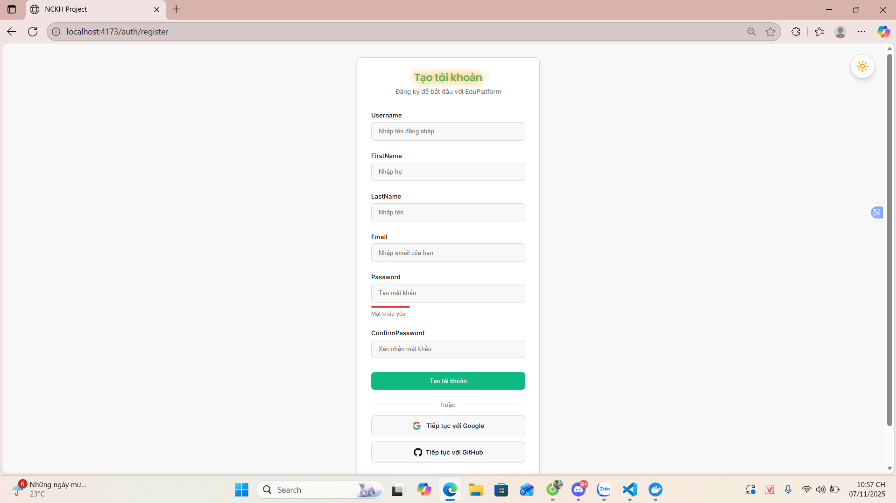
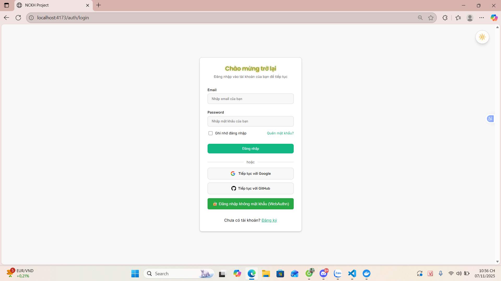
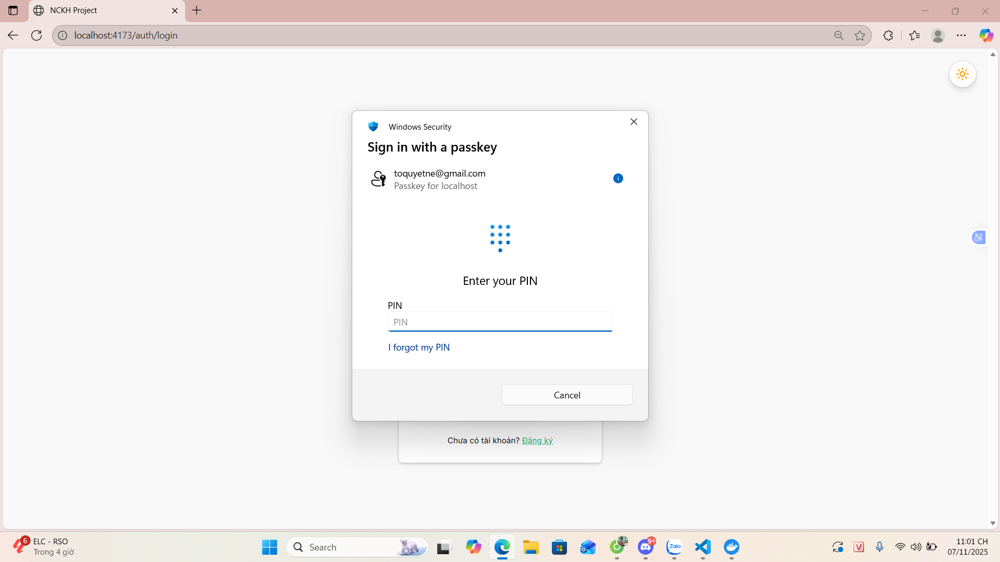
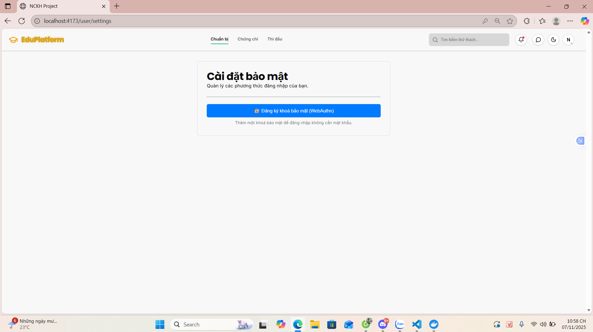
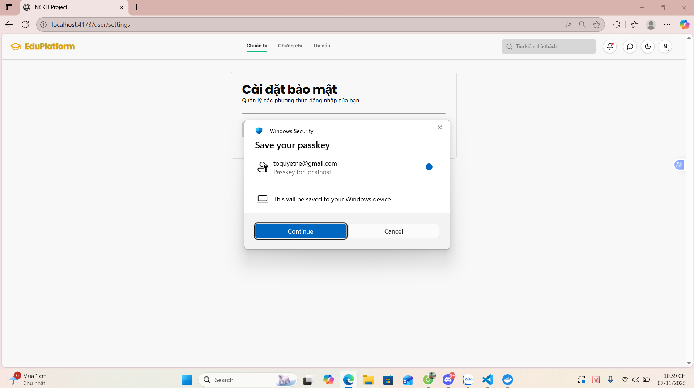
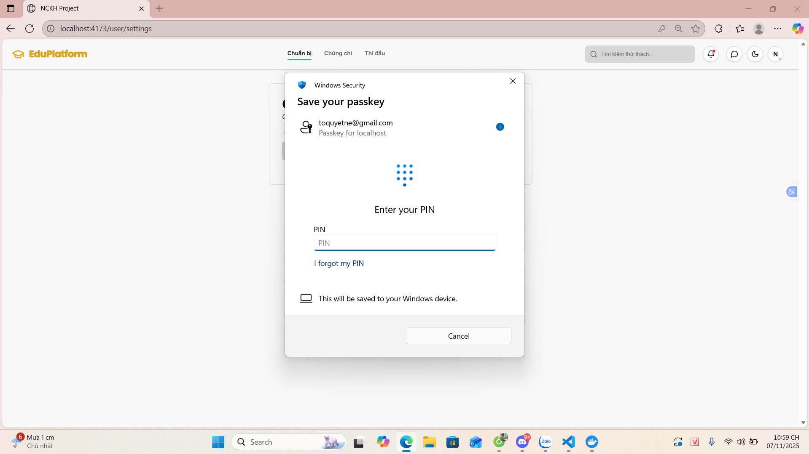
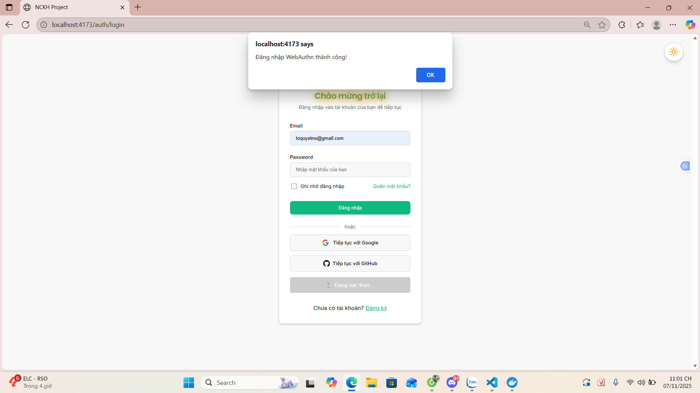
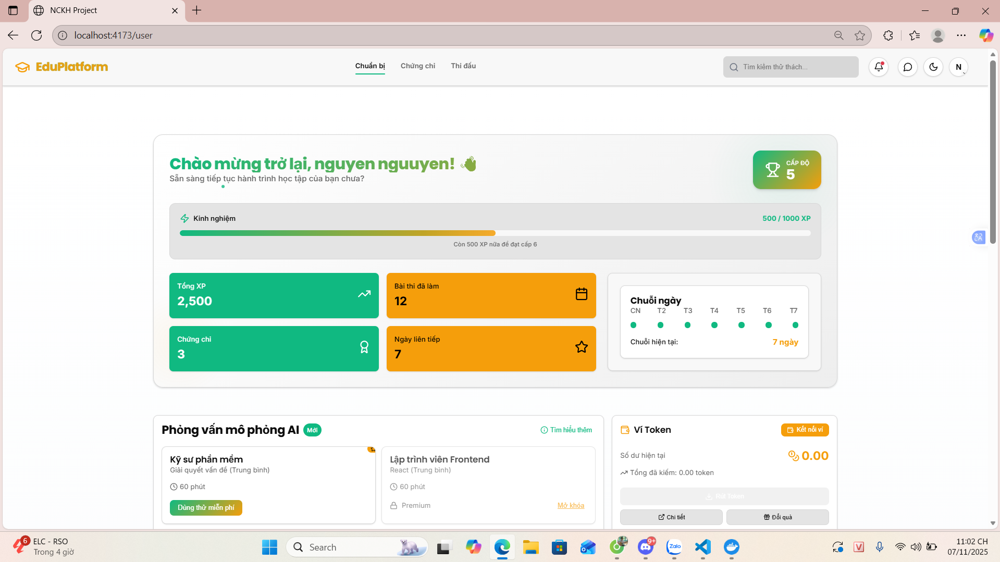

# Ứng dụng Web Demo Xác thực Không mật khẩu với WebAuthn/FIDO2

## 1. Giới thiệu đề tài

Dự án này là một dịch vụ định danh (Identity Service) được xây dựng nhằm minh họa cho phương thức xác thực hiện đại và an toàn: **đăng nhập không cần mật khẩu (passwordless)** sử dụng chuẩn **WebAuthn** và **FIDO2**.

Trong bối cảnh mật khẩu truyền thống ngày càng bộc lộ nhiều điểm yếu (dễ bị đánh cắp, tấn công phishing, người dùng có xu hướng đặt mật khẩu yếu), WebAuthn/FIDO2 nổi lên như một giải pháp thay thế vượt trội. Nó cho phép người dùng đăng nhập vào các ứng dụng web bằng các phương thức xác thực tích hợp sẵn trên thiết bị của họ như:
- **Sinh trắc học:** Vân tay, khuôn mặt (Windows Hello, Face ID, Touch ID).
- **Khóa bảo mật vật lý (Security Keys):** Các thiết bị USB/NFC/Bluetooth tuân thủ chuẩn FIDO2 (ví dụ: YubiKey).

Mục tiêu của dự án là xây dựng một hệ thống backend hoàn chỉnh, cho phép người dùng đăng ký, đăng nhập bằng cả phương pháp truyền thống (username/password) và phương pháp không mật khẩu, đồng thời quản lý vai trò và quyền hạn một cách linh hoạt.

## 2. Công nghệ sử dụng

- **Ngôn ngữ:** Java 21
- **Framework:** Spring Boot 3
- **Cơ sở dữ liệu:** PostgreSQL
- **Thư viện chính:**
  - `Spring Security`: Nền tảng xử lý xác thực và phân quyền.
  - `Spring Data JPA`: Tương tác với cơ sở dữ liệu PostgreSQL.
  - `JSON Web Tokens (JWT)`: Tạo và xác thực token cho các phiên làm việc API.
  - `com.yubico:webauthn-server-core`: Thư viện phía server để xử lý các yêu cầu đăng ký và xác thực WebAuthn.
  - `MapStruct`: Ánh xạ tự động và hiệu quả giữa các đối tượng DTO và Entity.
  - `Springdoc OpenAPI`: Tự động tạo tài liệu API (Swagger UI) để kiểm thử và minh họa.
  - `Spring Cloud Eureka Client`: Đăng ký và khám phá dịch vụ trong kiến trúc microservices.
  - `Redis`: Caching dữ liệu để tăng hiệu năng.

## 3. Cấu trúc thư mục dự án

Dự án theo cấu trúc chuẩn của một dự án Maven/Spring Boot, giúp dễ dàng quản lý và mở rộng.

```
.
├── src
│   ├── main
│   │   ├── java
│   │   │   └── com/dao/identity_service
│   │   │       ├── config          # Cấu hình Spring, khởi tạo dữ liệu (roles, users) ban đầu.
│   │   │       ├── controller      # Các REST API endpoints, bao gồm AuthController và WebAuthnController.
│   │   │       ├── dto             # Data Transfer Objects - Các đối tượng sạch để truyền dữ liệu.
│   │   │       ├── entity          # Các đối tượng ánh xạ tới bảng trong DB (JPA Entities).
│   │   │       ├── exception       # Xử lý tập trung các lỗi và ngoại lệ của ứng dụng.
│   │   │       ├── key             # Các lớp và repository liên quan đến việc lưu trữ thông tin WebAuthn credential.
│   │   │       ├── mapper          # Giao diện MapStruct để ánh xạ giữa DTO và Entity.
│   │   │       ├── repository      # Giao diện tương tác với DB (Spring Data Repositories).
│   │   │       ├── security        # Cấu hình bảo mật, bộ lọc JWT, và các dịch vụ liên quan.
│   │   │       └── service         # Chứa business logic chính của ứng dụng.
│   │   └── resources
│   │       ├── application.properties  # File cấu hình chính của ứng dụng (DB, JWT, Redis...).
│   │       └── static                  # Chứa file webauthn-demo.html để demo nhanh.
│   └── test                        # Mã nguồn cho việc kiểm thử.
├── pom.xml                         # File cấu hình của Maven, quản lý các dependency và build.
└── README.md                       # File hướng dẫn này.
```

## 4. Hướng dẫn cài đặt & chạy chương trình

### Yêu cầu môi trường

- **Java Development Kit (JDK):** Phiên bản 21 hoặc mới hơn.
- **Maven:** Phiên bản 3.8 hoặc mới hơn để quản lý project.
- **PostgreSQL:** Một instance PostgreSQL đang hoạt động.
- **Trình duyệt hỗ trợ WebAuthn:** Chrome, Firefox, Edge, Safari phiên bản mới nhất.

### Cách import database

1.  Sử dụng một công cụ quản lý DB (như DBeaver, pgAdmin), tạo một database mới trong PostgreSQL (ví dụ: `identity_db`).
2.  Hệ thống được cấu hình với `spring.jpa.hibernate.ddl-auto=update`. Điều này có nghĩa là khi ứng dụng khởi chạy, Hibernate sẽ tự động so sánh các `Entity` trong code với schema của DB và tự động tạo/cập nhật các bảng. Bạn **không cần** phải chạy file SQL nào để khởi tạo cấu trúc bảng.

### Cách cấu hình file kết nối DB

1.  Mở file `src/main/resources/application.properties`.
2.  Tìm đến mục `Database Configuration` và chỉnh sửa các thông tin cho phù hợp với môi trường PostgreSQL của bạn:

    ```properties
    # Database Configuration
    spring.datasource.url=${SPRING_DATASOURCE_URL:jdbc:postgresql://localhost:5433/identity_db}
    spring.datasource.username=${SPRING_DATASOURCE_USERNAME:postgres}
    spring.datasource.password=${SPRING_DATASOURCE_PASSWORD:password}
    ```

    - **`spring.datasource.url`**: Thay đổi `localhost:5433` thành địa chỉ và cổng của server PostgreSQL, và `identity_db` thành tên database bạn đã tạo.
    - **`spring.datasource.username`**: Tên đăng nhập vào PostgreSQL.
    - **`spring.datasource.password`**: Mật khẩu tương ứng.

### Lệnh chạy hệ thống

1.  Mở Terminal (hoặc Command Prompt/PowerShell trên Windows) tại thư mục gốc của dự án (`identity-service`).
2.  Dùng Maven để build dự án. Lệnh này sẽ tải các thư viện cần thiết và biên dịch code:
    ```shell
    mvn clean install
    ```
3.  Sau khi build thành công, chạy lệnh sau để khởi động ứng dụng:
    ```shell
    mvn spring-boot:run
    ```
4.  Nếu không có lỗi, dịch vụ sẽ khởi chạy tại địa chỉ `http://localhost:9000`.
5.  Bạn có thể truy cập `http://localhost:9000/swagger-ui/index.html` để xem danh sách các API và thử nghiệm.

## 5. Tài khoản demo

Khi ứng dụng khởi chạy lần đầu tiên, hệ thống sẽ tự động tạo 2 tài khoản mặc định để đăng nhập và kiểm thử các vai trò khác nhau:

| Vai trò | Username | Password   | Ghi chú |
| :------- | :------- | :--------- | :--- |
| **Admin**  | `admin`  | `admin123` | Có toàn bộ quyền hạn trong hệ thống. |
| **User**   | `user`   | `user123`  | Có các quyền hạn cơ bản của người dùng. |

## 6. Kết quả và hình ảnh minh họa

Dưới đây là một số hình ảnh minh họa các chức năng chính của ứng dụng.

---

**1. Giao diện đăng ký tài khoản**
*(Mô tả: Giao diện cho phép người dùng nhập thông tin để tạo tài khoản mới.)*



---

**2. Giao diện đăng nhập**
*(Mô tả: Người dùng có thể chọn đăng nhập bằng mật khẩu hoặc sử dụng phương thức không mật khẩu.)*




---

**3. Đăng ký phương thức xác thực không mật khẩu (WebAuthn)**
*(Mô tả: Sau khi đăng nhập, người dùng vào trang cá nhân và đăng ký một khóa bảo mật hoặc sinh trắc học.)*



---

**4. Hộp thoại yêu cầu xác thực của trình duyệt/hệ điều hành**
*(Mô tả: Khi người dùng chọn đăng nhập không mật khẩu, trình duyệt sẽ hiển thị hộp thoại yêu cầu xác nhận bằng vân tay, khuôn mặt hoặc khóa bảo mật.)*




---

**5. Giao diện sau khi đăng nhập thành công**
*(Mô tả: Giao diện chính của ứng dụng sau khi người dùng đã xác thực thành công, hiển thị thông tin người dùng.)*



---

**6. Giao diện xác thực thành công**


---

**7. Giao diện trang chủ**



---